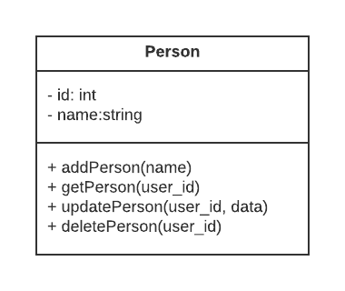

# A Simple REST API capable of CRUD operations on a "person" resource.

> LIVE API Endpoint is hosted on https://worried-gold-turtleneck.cyclic.app/api

> Documentation can be found in [DOCUMENTATION.md](DOCUMENTATION.md)

## Table of Contents

- [Model Diagrams](#model-diagrams)
- [Prerequisites](#prerequisites)
- [Getting Started](#getting-started)
  - [1. Clone the Repository](#1-clone-the-repository)
  - [2. Install Dependencies](#2-install-dependencies)
  - [3. Run the API Locally](#3-run-the-api-locally)
- [API Endpoints](#api-endpoints)
- [Request/Response Formats](#requestresponse-formats)
- [Known Limitations and Assumptions](#known-limitations-and-assumptions)
- [Deployment](#deployment)

---

## Model Diagram

- Unified Modeling Language (UML)
> 

---

## Prerequisites

To get started, the following requirements should be met:

- Node 18.12 or higher.
- Git (for cloning the repository).
- A MongoDB Database URL.
---

## Getting Started

Follow these steps to set up and run the API locally.

### 1. Clone the Repository

To clone this repository to your local machine:

`git clone https://github.com/HayatsCodes/HNGx.git`

Then `cd HNGx/stage-2`

### 2. Install Dependencies

Install the required dependencies using `npm`:

`npm install`

This will install Express, Mongoose, dotenv and Morgan.

### 3. Run the API Locally

Before starting the API Server, Make sure to create a `.env` file and put the following:
```
MONGO_URL={Your MONGODB Database URL}
PORT=3001
```

To run the API locally, run:

`npm start`

This will start the API server at `http://localhost:3001/`.

---

## API Endpoints

The API provides the following endpoints for CRUD operations on the "Person" resource:

- **Create a Person**:
  - **POST /api/**
  - Add a new person.

- **Read a Person**:
  - **GET /api/:id**
  - Fetch details of a person by id.

- **Update a Person**:
  - **PATCH /api/:id**
  - Modify details of an existing person by id.

- **Delete a Person**:
  - **DELETE /api/:id**
  - Remove a person by id.

---

## Request/Response Formats

### Create a Person (POST /api/)

**Request Format:**

```json
{
  "name": "Abdul Olaide"
}
```

**Response Format (Success - 201):**

```json
{
  "_id": "1",
  "name": "Abdul Olaide"
}
```

### Read a Person (GET /api/:id)

**Response Format (Success - 200):**

```json
{
   "_id": "1",
  "name": "Abdul Olaide"
}
```

**Response Format (Bad request - 400):**

```json
  "Name can only be of type String"
```

```json
  "Name already exist"
```

**Response Format (Bad request - 404):**
```json
  "Person not found"
```


### Update a Person (PATCH /api/:id)

**Request Format:**

```json
{
  "name": "Abdul Ola"
}
```

**Response Format (Success - 200):**

```json
{
  "_id": "1",
  "name": "Abdul Ola"
}
```

**Response Format (Not Found - 404):**

```json
  "Person not found"
```

### Delete a Person (DELETE /api/{name})

**Response Format (Success - 200):**

```json
{
  "_id": "1",
  "name": "Abdul Ola"
}
```

**Response Format (Not Found - 404):**

```json
  "Person not found"
```

---

## Known Limitations and Assumptions
- This documentation assumes that you have successfully set up the API locally.

---

## Deployment

To deploy this API to a production server, follow the appropriate deployment practices for Express applications